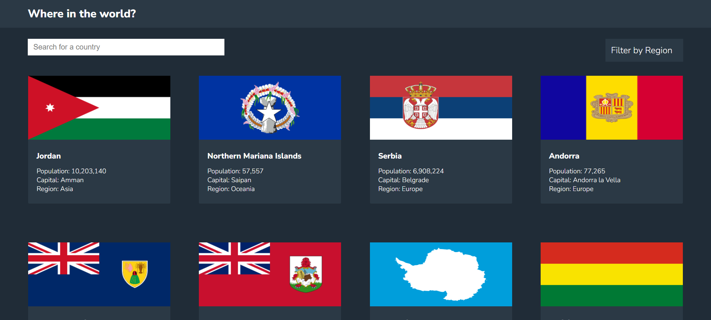

# Rest-countries
# Frontend Mentor - REST Countries API  solution

This is a solution to the [REST Countries API challenge on Frontend Mentor](https://www.frontendmentor.io/challenges/rest-countries-api-with-color-theme-switcher-5cacc469fec04111f7b848ca). Frontend Mentor challenges help you improve your coding skills by building realistic projects. 

## Table of contents

- [Overview](#overview)
  - [The challenge](#the-challenge)
  - [Screenshot](#screenshot)
  - [Links](#links)
- [My process](#my-process)
  - [Built with](#built-with)
  - [What I learned](#what-i-learned)
  - [Continued development](#continued-development)
  - [Useful resources](#useful-resources)
- [Author](#author)
- [Acknowledgments](#acknowledgments)

**Note: Delete this note and update the table of contents based on what sections you keep.**

## Overview

### The challenge

Users should be able to:

- See all countries from the API on the homepage
- Search for a country using an `input` field
- Filter countries by region
- Click on a country to see more detailed information on a separate page
- Click through to the border countries on the detail page

### Screenshot




### Links

- Solution URL: [Add solution URL here](https://your-solution-url.com)
- Live Site URL: [Add live site URL here](https://your-live-site-url.com)

## My process

### Built with

- Semantic HTML5 markup
- CSS custom properties
- Flexbox
- CSS Grid
- JavaScript fetch API


### What I learned

Use this section to recap over some of your major learnings while working through this project. Writing these out and providing code samples of areas you want to highlight is a great way to reinforce your own knowledge.

To see how you can add code snippets, see below:

```js
    // Fetch the full names of the bordering countries
    const borderCountryNames = borderCountries.map((code) => {
      const borderCountry = countries.find((c) => c.cca3 === code);
      return borderCountry ? borderCountry.name.common : "Unknown Country";
    });

    const borderCountriesElement = document.createElement("p");

    if (borderCountryNames.length > 0) {
      borderCountriesElement.textContent = "Border Countries:";
    } else {
      borderCountriesElement.textContent = "No bordering countries.";
    }

    // Assuming you have already calculated the 'borderCountryNames' array

    borderCountryNames.forEach((borderCountryName) => {
      const borderCountryElement = document.createElement("span");
      borderCountryElement.textContent = borderCountryName;
      borderCountryElement.classList.add("bordercountries");
      borderCountryElement.onclick = () => {
        const borderCountryData = getCountryByName(borderCountryName);
        displaySingleCountry(borderCountryData);
      };
      borderCountriesElement.appendChild(borderCountryElement);
      borderCountriesElement.classList.add("border");
    });
```


### Continued development

This is my third project using the fetch API, I think I am finally comfortable with it. I'll move on to learn React now.


## Author

- Frontend Mentor - [@yourusername](https://www.frontendmentor.io/profile/lamba01)
- Twitter - [@lambacodes](https://www.twitter.com/lambacodes)


## Acknowledgments
Once again, thank myself for not giving up.
